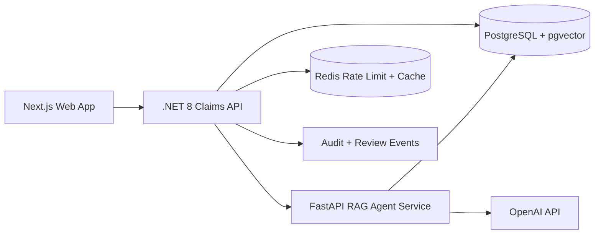

# PolicyClaim AI Platform

Claims, Underwriting & Payment Review System

PolicyClaim AI Platform is a recruiter-facing enterprise insurance demo that combines a polished Next.js product experience with a .NET 8 API, a FastAPI RAG and agent service, synthetic insurance data, evals, and deployment-ready infrastructure.

It is also structured as a reference project for learning how product workflows, backend APIs, AI retrieval systems, guardrails, evals, CI/CD, and cloud deployment pieces fit together in one production-style application.

The public demo runs a lightweight recruiter-safe deployment profile with Vercel-hosted Python API routes and synthetic data, while the repository includes Docker, Azure DevOps, Azure Container Apps, and AKS-ready configuration to demonstrate production deployment readiness.

Live demo: https://policyclaim-ai-platform.vercel.app

GitHub: https://github.com/Mario-Vishal/policyclaim-ai-platform

## Architecture



## Modes

Business Mode covers claim intake, policy search, coverage review, underwriting risk checks, payment reconciliation, reviewer queue management, and audit history.

Engineering Mode visualizes the AI system behind the workflow: RAG pipeline replay, tool-call timeline, hybrid retrieval, reranking, context packing, guardrails, citations, eval metrics, and latency waterfalls.

The Guide page gives reviewers a suggested path through the live demo: start with a claim, run AI review, record a decision, then inspect Engineering Mode.

## Tech Stack

- Frontend: Next.js, React, TypeScript, Tailwind CSS, Framer Motion, React Flow, Recharts, Playwright
- API: .NET 8, ASP.NET Core Web API, OpenAPI/Swagger, xUnit-ready tests
- AI service: FastAPI, OpenAI API, PostgreSQL + pgvector, hybrid retrieval, guardrails, pytest
- Infra: Docker Compose, Azure Container Apps, Azure DevOps YAML, AKS-ready manifests, Vercel config

## Local Setup

```bash
docker compose -f infra/docker-compose.yml up --build
```

Separate service commands:

```bash
cd apps/web && npm install && npm run dev
cd apps/api && dotnet restore && dotnet run
cd apps/ai-service && pip install -r requirements.txt && uvicorn app.main:app --reload
```

For Python development, use a virtual environment before installing service dependencies:

```bash
python -m venv .venv
.venv\Scripts\activate
pip install -r apps/ai-service/requirements.txt
```

## Environment Variables

Copy `.env.example` into service-specific `.env` files or configure these in the deployment targets:

- `OPENAI_API_KEY`
- `OPENAI_MODEL`
- `OPENAI_EMBEDDING_MODEL`
- `NEXT_PUBLIC_API_BASE_URL`
- `AI_SERVICE_BASE_URL`
- `DATABASE_URL`
- `REDIS_URL`
- `APPLICATIONINSIGHTS_CONNECTION_STRING`

OpenAI keys are used only by backend services. The web app never receives the API key.

## AI Agent Tools

- `search_policy(query, filters)`
- `check_claim_coverage(claim_id, policy_id)`
- `detect_missing_documents(claim_id)`
- `flag_underwriting_risk(claim_id)`
- `calculate_payment_status(claim_id)`
- `create_reviewer_task(claim_id, reason)`
- `write_audit_event(entity_id, event_type, details)`

## RAG Pipeline

Document ingestion performs contextual chunking, metadata extraction, embeddings, pgvector storage, keyword search, vector search, hybrid merge, reranking, context packing, answer generation, grounded citations, guardrail checks, output validation, and trace logging.

The live Vercel demo includes Python API routes that search a generated synthetic corpus of 144 claims, 72 policies, 378 audit events, and 96 RAG chunks. `/api/rag-ask` calls OpenAI when `OPENAI_API_KEY` is configured and clearly labels fallback mode when it is not.

## Eval Harness

The eval harness under `packages/evals` includes coverage, exclusion, payment, missing document, underwriting, citation, PII, and prompt-injection cases. It reports retrieval recall at 5, citation accuracy, groundedness, tool-call success, PII leak rate, prompt-injection block rate, latency p50/p95, and human override rate.

## Deployment

Vercel:

```bash
cd apps/web
vercel link
vercel env add NEXT_PUBLIC_API_BASE_URL
vercel env add OPENAI_API_KEY
vercel env add OPENAI_MODEL
vercel deploy
vercel --prod
```

Azure Container Apps instructions are in `infra/azure-container-apps/README.md`.

## Verification

Latest local verification:

- `cd apps/web && npm run lint`
- `cd apps/web && npm run build`
- `cd apps/web && npm run test:e2e`
- `cd apps/api && dotnet test PolicyClaim.sln`
- `cd apps/ai-service && python -m pytest`
- `cd packages/evals && python run_evals.py && python -m pytest`
- `docker compose -f infra/docker-compose.yml config`

Local tooling installed on this workstation includes Node.js/npm, Docker, Python, GitHub CLI, Vercel CLI, .NET 8 SDK, and Azure CLI.

## Screenshots

Screenshots should be added after Vercel deployment.
