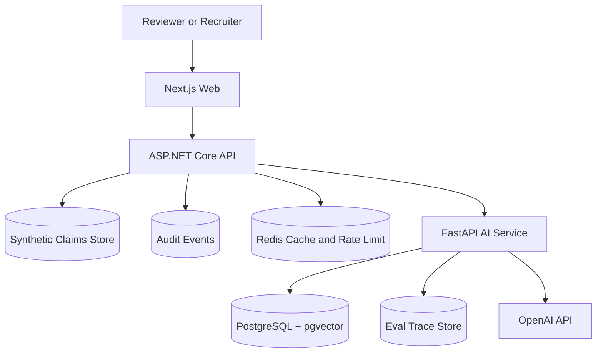

# Architecture

PolicyClaim AI Platform uses three primary runtime services:

- `apps/web`: Next.js recruiter-facing web application with Business Mode and Engineering Mode.
- `apps/api`: .NET 8 ASP.NET Core API that owns claims, policies, payments, reviewer tasks, audit events, auth boundaries, and the `/api/ai/ask` proxy.
- `apps/ai-service`: FastAPI service that owns RAG, agent tool orchestration, guardrails, traces, eval execution, and backend-only OpenAI calls.

The API remains the trusted backend boundary. The frontend never calls OpenAI directly and never receives backend secrets.
